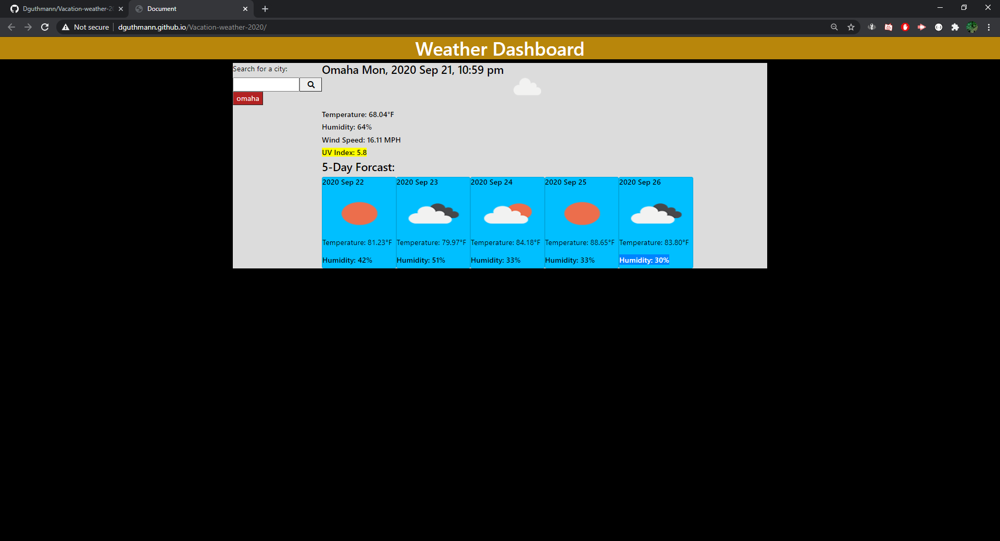

# Vacation-weather-2020
### Author: David Guthmann

github: https://github.com/Dguthmann/  
livesite: https://dguthmann.github.io/Vacation-weather-2020/

## List of Contents

index.html
script.js
style.css
README.md
screenshot.png

## Basic Overview of Project

The Goal of this project is to make a weather api.
The user can search for a city and relavant information on the present and future weather will be generated.
Past Searched Cities will be generated as buttons on the side.
User can also click on those past searches, and see the data for the city button clicked.
(note: must click out of the box before clicking for the save works)

## Screenshot of Website

## Resources Used

Zach Auerbach explanation of ajax error: calls, asynchonous bubbling calls.

## Further Development Plans

As of submission this is considered a complete project as there are very large security flaws with this design.

## Changelog

2020-09-22: Adding of error code check (asynch causing issues still), final bug fix and submission.  
2020-09-21: Psuedocoding Script, Procedural Generation of html, Button functionality, saving to local.
